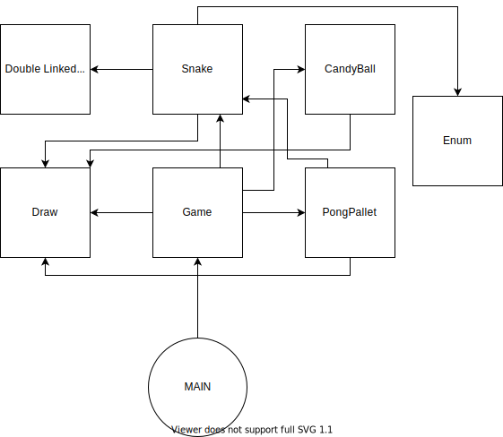

# SnakePong
1. Maak een analyse van het probleem, bedenk welke componenten je allemaal nodig hebt enbeschrijf  dit in een README.md. Hierbij verwacht ik ook een schema van de code.

2. Deel de code op in de functionele game logic en de weergave. Je mag de weergave beperken toteen print in de console. Je hoeft het spel niet real-time kunnen spelen.

3. Voorzie testen voor de game logic. Je hoeft niet alles te testen.

# Plan of action
Hieronder vind je mijn stappenplan in het maken van SnakePong.
## Stap 1: Snake
Eerst en vooral wil ik een werkende Snake maken. Eventueel met het gebruik van Pygame om te tekenen. Voor Snake heb ik de volgende klassen nodig:

* Klasse Game:
    * Hierin zou de game logica van Snake moeten gemaakt worden.
* Klasse Snake:
    * Hierin zou alle logica moeten zitten voor de Snake.
* Klasse Candyball:
    * Deze zou in eerste instantie een statische candy moeten genereren. Later zou deze ook dynamisch moeten kunnen bewegen.
* Klasse Walls:
    * Hierin moeten de walls gedefinieerd kunnen worden.
* Klasse Grid:
    * Hierin zou de grid moeten zitten die getekend moet worden op het scherm.
* Klasse Draw:
    * Deze klasse zou alles moeten visualiseren in de console. Eventueel kan ik hier gebruik maken van Pygame.
* Main:
    * Hierin moet er enkel een instantie van game gemaakt worden en moet deze constant geüpdated worden.
## Stap 2: Pong
Als tweede zou ik een werkende pong willen maken. Hiervoor kan ik sommige klassen van hierboven herbruiken. Namelijk de volgende:
* Klasse CandyBall. (Mits aanpassing voor dynamisch te bewegen.)
* Klasse Walls.
* Klasse Grid.
* Klasse Draw.
* Main.

Ook zou ik twee nieuwe klasses moeten maken:

* Klasse GamePong:
    * Hierin zou de game logica van Pong moeten gemaakt worden.
* Klasse PongPallet:
    * Hierin zou de logica voor de palletjes van Pong moeten zitten.

# Blokdiagramma
Hieronder vind je het blokdiagramma.

